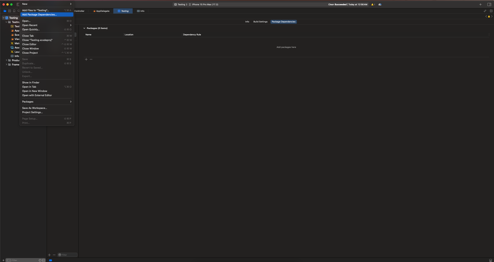
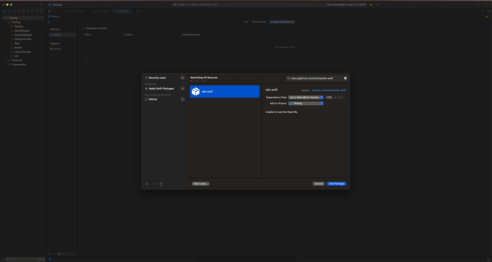
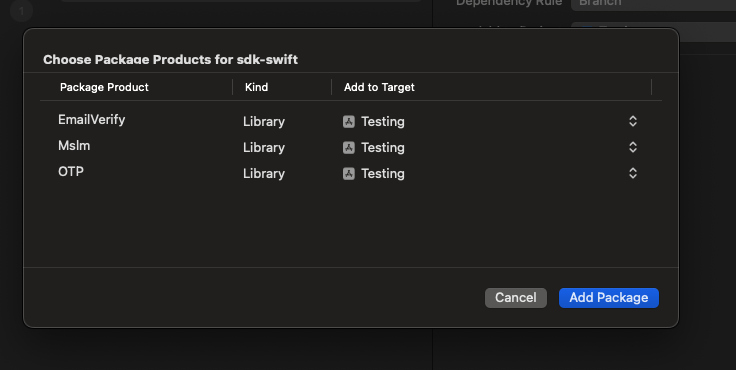

# Swift Package Manager for Mslm

## Requirements

- Requires Xcode 14.1 or above
- See [Package.swift](Package.swift) for supported platform versions.

## Installation

### Installing from Xcode

Add a package by selecting `File` → `Add Packages…` in Xcode’s menu bar.



---

Search for the Mslm SDK using the repo's URL:

```console
https://github.com/mslmio/sdk-swift.git
```

Next, set the **Dependency Rule** to be `Up to Next Major Version`.

Then, select **Add Package**.



---

Choose the Mslm products that you want installed in your app.



---

### Selecting Products

- To use the entire Mslm SDK, select the Mslm package.
- To add specific products individually, choose from the list of available products.

Selecting the Mslm package installs the full suite of Mslm products. If you only need specific functionalities (e.g., OTP or EmailVerify), you can choose individual products to minimize dependencies.

Feel free to customize your Mslm installation based on your project requirements.

---

### Alternatively, add Mslm to a `Package.swift` manifest

To integrate via a `Package.swift` manifest instead of Xcode, you can add
Mslm to the dependencies array of your package:

```swift
dependencies: [
  .package(
    name: "Mslm",
    url: "https://github.com/mslmio/sdk-swift.git",
    .upToNextMajor(from: "1.0.0")
  ),

  // Any other dependencies you have...
],
```

## Questions and Issues

Please provide any feedback via a [GitHub Issue](https://github.com/mslmio/sdk-swift/issues/new).
